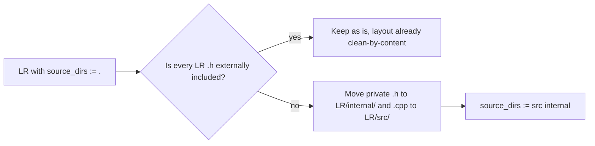

# ZXTune — Library Structure & Public-API Hygiene

This file documents the build-system packaging conventions of the ZXTune source tree under [`src/`](/src) and identifies LR headers that pretend to be public API but are in fact only consumed inside their owning library.

The build system is a custom set of hand-written `.mak` includes (see [`makefile.mak`](/makefile.mak), [`libraries.mak`](/libraries.mak)).

### Methodology

- **Library Root (LR)** = directory that contains a `Makefile` declaring `library_name := <id>`.
- A library **owns** the entire subtree rooted at its LR, **except** subtrees that have their own LR — those belong to their own library.
- **Public** header at LR ⇔ at least one translation unit *outside* the owning library `#include`s it.
- **Private candidate** ⇔ no external inclusion found by `search_files` over the whole workspace, after excluding (a) the LR's own `.cpp`, (b) declared sub-`source_dirs`, (c) same-library tests, and (d) **any test translation unit anywhere in the tree** — tests are treated as privileged consumers that may include private headers (i.e. tests are *not* external clients).
- Some libraries are **mutually-exclusive variants of the same component** that share source files: e.g. `core_plugins_archives` (full) vs. `core_plugins_archives_lite` vs. `core_plugins_archives_stub`; `l10n` vs. `l10n_stub`; `sound_backends` plus its `winstub` companion. Only one variant is linked into a given build. Headers shared across such variants are treated as part of one logical library for the analysis below.

---

## 1. Packaging convention

Each component is packaged 1:1 into a static library described by a `Makefile` at the LR declaring `library_name := <id>`.

A header at LR is "**public**" if any translation unit *outside* its owning library `#include`s it; "**private candidate**" otherwise (with evidence collected by `search_files`).

The Makefile also chooses one of two layouts:

- **Clean layout — `source_dirs := src` (preferred).** All `.h` files at LR are public API; all `.cpp` lives under `src/` and is private. Examples: [`src/binary/Makefile`](/src/binary/Makefile), [`src/parameters/Makefile`](/src/parameters/Makefile), [`src/io/Makefile`](/src/io/Makefile), [`src/strings/Makefile`](/src/strings/Makefile), [`src/sound/Makefile`](/src/sound/Makefile), [`src/module/Makefile`](/src/module/Makefile), [`src/devices/aym/Makefile`](/src/devices/aym/Makefile).
- **Mixed layout — `source_dirs := .` (or `.` plus other subdirs).** Implementation `.cpp` and "public" `.h` are siblings at LR. Every header at LR is *nominally* public, but in practice many are only consumed by the library's own `.cpp` files or by sibling files in declared sub-source-dirs. Examples: [`src/module/players/Makefile`](/src/module/players/Makefile) (`source_dirs := . aym dac saa tfm xsf`), [`src/formats/chiptune/Makefile`](/src/formats/chiptune/Makefile) (`. aym digital emulation fm multidevice music saa`), [`src/core/plugins/players/Makefile`](/src/core/plugins/players/Makefile) (`. asap ay dac gme mpt …`), [`src/sound/backends/Makefile`](/src/sound/backends/Makefile), [`src/devices/aym/dumper/Makefile`](/src/devices/aym/dumper/Makefile).

---

## 2. Library catalog (1:1 component → library)

| LR | `library_name` | Layout | Notes |
|----|----------------|--------|-------|
| [`src/tools`](/src/tools) | `tools` | clean (`src`) | low-level helpers |
| [`src/binary`](/src/binary) | `binary` | clean | core byte abstractions |
| [`src/binary/compression`](/src/binary/compression) | `binary_compression` | clean | zlib wrappers |
| [`src/binary/format`](/src/binary/format) | `binary_format` | mixed | grammar/lex are intentionally private; LR `.h` are all impl-only |
| [`src/strings`](/src/strings) | `strings` | clean | |
| [`src/parameters`](/src/parameters) | `parameters` | clean | |
| [`src/analysis`](/src/analysis) | `analysis` | clean | |
| [`src/io`](/src/io) | `io` | clean | |
| [`src/async`](/src/async) | `async` | clean | |
| [`src/debug`](/src/debug) | `debug` | clean | |
| [`src/resource`](/src/resource) | `resource` | clean | |
| [`src/l10n`](/src/l10n) / [`src/l10n/stub`](/src/l10n/stub) | `l10n` / `l10n_stub` | clean | mutually-exclusive variants |
| [`src/platform`](/src/platform) / `application` / `version` | `platform*` | clean | |
| [`src/sound`](/src/sound) | `sound` | clean | |
| [`src/sound/backends`](/src/sound/backends) | `sound_backends` | mixed (`source_files`) | per-backend pairs of public `.h` + `_backend.cpp`/`_stub.cpp`; many LR `.h` are private |
| [`src/sound/backends/winstub`](/src/sound/backends/winstub) | `sound_backends_winstub` | mixed | companion to `sound_backends` |
| [`src/devices/aym`](/src/devices/aym) | `devices_aym` | clean (`src`) | LR `chip.h`, `dumper.h` are public |
| [`src/devices/aym/dumper`](/src/devices/aym/dumper) | `devices_aym_dumper` | mixed | |
| [`src/devices/{beeper,dac,fm,saa,z80}`](/src/devices) | `devices_*` | mixed | tiny libs, mostly fine |
| [`src/formats/chiptune`](/src/formats/chiptune) | `formats_chiptune` | mixed | LR has 7 headers; `decoders.h` is the genuine public surface, others are intra-library |
| [`src/formats/archived`](/src/formats/archived) | `formats_archived` | mixed | |
| [`src/formats/archived/multitrack`](/src/formats/archived/multitrack) | `formats_archived_multitrack` | mixed | |
| [`src/formats/packed`](/src/formats/packed) | `formats_packed` | mixed | |
| [`src/formats/packed/{decompilers,archives,lha}`](/src/formats/packed) | `formats_packed_*` | mixed | |
| [`src/formats/multitrack`](/src/formats/multitrack) | `formats_multitrack` | mixed | |
| [`src/formats/image`](/src/formats/image) | `formats_image` | mixed | |
| [`src/module`](/src/module) | `module` | clean (`src`) | all 8 LR headers are genuinely public |
| [`src/module/properties`](/src/module/properties) | `module_properties` | mixed | LR `path.h` is public |
| [`src/module/conversion`](/src/module/conversion) | `module_conversion` | mixed | LR `api.h`, `parameters.h` are public |
| [`src/module/players`](/src/module/players) | `module_players` | mixed (`. aym dac saa tfm xsf`) | **largest offender** — 13 LR headers, ~half are intra-library only |
| [`src/core`](/src/core) | `core` | clean (`plugins src`) | 9 LR headers are public to apps |
| [`src/core/plugins/archives`](/src/core/plugins/archives) | `core_plugins_archives` | mixed | mutually-exclusive with `_lite` / `_stub` |
| [`src/core/plugins/archives/{stub,lite}`](/src/core/plugins/archives) | variants | mixed | |
| [`src/core/plugins/players`](/src/core/plugins/players) | `core_plugins_players` | mixed (`. asap ay dac …`) | LR `enumerator.cpp`, `scan_result.{h,cpp}`, plugin registrar headers; some are sub-tree-only |

---

## 3. Headers at LR that should be made private (evidence-based)

A header at LR is a **candidate for private** when *no* `#include` of it appears outside its own library, after excluding (a) the LR's own `.cpp`, (b) `.cpp`/`.h` in the LR's other declared `source_dirs`, and (c) other test-only sources inside the same library tree. Evidence below was collected by `search_files` over the entire workspace.

### 3.1 Library `module_players` ([`src/module/players`](/src/module/players))

**Scoping assumption (namespace-aware).** The classification below assumes the planned migration where every translation unit currently under [`src/core/plugins/players/`](/src/core/plugins/players) **whose code is in the `Module::*` namespace** is logically part of the `module_players` library; only the `ZXTune::*` registration code in those directories remains in [`core_plugins_players`](/src/core/plugins/players). Concretely:

- All `*_base.cpp` files (e.g. [`xmp/xmp_base.cpp`](/src/core/plugins/players/xmp/xmp_base.cpp), [`mpt/openmpt_base.cpp`](/src/core/plugins/players/mpt/openmpt_base.cpp)) split: their `Module::*` `Holder`/`Renderer`/`Factory` impl moves to `module_players`; their tail `namespace ZXTune { Register…Plugins(...) }` stays in `core_plugins_players`.
- All dual-namespace `*_supp.cpp` files (`music/{wav,ogg,mp3,flac}_supp.cpp`, `multi/mtc_supp.cpp`, `gme/{kss,spc}_supp.cpp`, [`ay/ts_supp.cpp`](/src/core/plugins/players/ay/ts_supp.cpp)) likewise split.
- The dual-namespace LR headers [`plugin.h`](/src/core/plugins/players/plugin.h) and [`multitrack_plugin.h`](/src/core/plugins/players/multitrack_plugin.h) split into a `Module::` half (factory facade — migrates) and a `ZXTune::` half (registration — stays).
- Pure-`ZXTune::` files ([`plugin.cpp`](/src/core/plugins/players/plugin.cpp:24), [`multitrack_plugin.cpp`](/src/core/plugins/players/multitrack_plugin.cpp:28), all `xsf/*_supp.cpp`, `saa/cop_supp.cpp`, `tfm/{tfc,tfd,tfe}_supp.cpp`, `dac/{chi,ahx,dst,pdt,v2m,str,dmm,sqd,et1}_supp.cpp`, all `ay/*_supp.cpp` except `ts_supp.cpp`) stay entirely in `core_plugins_players`.

Under this scope, an `#include "module/players/X.h"` from a `core/plugins/players/**` translation unit is **intra-`module_players`** if the consuming code sits inside a `Module::*` namespace block, and is **cross-library** only if the consuming code sits inside a `ZXTune::*` block.

LR headers: `duration.h`, `factory.h`, `iterator.h`, `pipeline.h`, `platforms.h`, `properties_helper.h`, `properties_meta.h`, `simple_orderlist.h`, `stream_model.h`, `streaming.h`, `track_model.h`, `tracking.h`.

| Header | Cross-library users (post-migration) | Verdict |
|--------|--------------------------------------|---------|
| [`pipeline.h`](/src/module/players/pipeline.h) | [`apps/zxtune-android/.../player.cpp:21`](apps/zxtune-android/zxtune/src/main/jni/player.cpp:21), [`src/sound/backends/backend_impl.cpp:13`](/src/sound/backends/backend_impl.cpp:13) | **Public** — keep (Android JNI + `sound_backends`) |
| [`properties_helper.h`](/src/module/players/properties_helper.h) | [`core/plugins/players/plugin.cpp:14`](/src/core/plugins/players/plugin.cpp:14) and [`multitrack_plugin.cpp:16`](/src/core/plugins/players/multitrack_plugin.cpp:16), both pure `namespace ZXTune` (stay in `core_plugins_players`) | **Public** — keep |
| [`factory.h`](/src/module/players/factory.h) | only [`plugin.h:14`](/src/core/plugins/players/plugin.h:14) and [`multitrack_plugin.h:15`](/src/core/plugins/players/multitrack_plugin.h:15); both inclusions serve those headers' `Module::` blocks (which migrate) — every `Module::*Factory`/`Module::ExternalParsingFactory` consumer is in `Module::*` code | **Private candidate** (was Public) — becomes strictly intra-`module_players` after migration |
| [`duration.h`](/src/module/players/duration.h) | only `core/plugins/players/**/*_base.cpp` and dual-namespace `*_supp.cpp`, every use in their `Module::*` blocks | **Private candidate** (was Public) |
| [`platforms.h`](/src/module/players/platforms.h) | only `core/plugins/players/{vgm,vgmstream,sid,asap,gme,…}/*_base.cpp` and `music/*_supp.cpp`; all consumers in `Module::*` blocks | **Private candidate** (was Public) |
| [`streaming.h`](/src/module/players/streaming.h) | only `core/plugins/players/**/*_base.cpp` (gme, sid, asap, vgm, …) and dual `*_supp.cpp`, all in `Module::*` blocks | **Private candidate** (was Public) |
| [`properties_meta.h`](/src/module/players/properties_meta.h) | only `core/plugins/players/{vgm,vgmstream,music/*,…}/*_supp.cpp`/`*_base.cpp`, all in `Module::*` blocks | **Private candidate** (was Public) |
| [`tracking.h`](/src/module/players/tracking.h) | only [`ay/ts_supp.cpp:17`](/src/core/plugins/players/ay/ts_supp.cpp:17), in its `Module::TS` block (the file is dual-namespace and the `Module::` portion migrates) | **Private candidate** (was Public — single use, and that use migrates) |
| [`iterator.h`](/src/module/players/iterator.h) | only intra-library transitive includes from `streaming.h`/`tracking.h` and a few `module/players/**` headers | **Private candidate** — unchanged |
| [`track_model.h`](/src/module/players/track_model.h) | only intra-library | **Private candidate** — unchanged |
| [`stream_model.h`](/src/module/players/stream_model.h) | only intra-library | **Private candidate** — unchanged |
| [`simple_orderlist.h`](/src/module/players/simple_orderlist.h) | only intra-library (every tracker `.cpp`) | **Private candidate** — unchanged |

Net effect: under the namespace-aware scope only **2 of 12** LR headers (`pipeline.h`, `properties_helper.h`) carry a real public contract — the rest are implementation details exposed through a mixed-layout Makefile.

Recommendation: after the planned migration of `Module::*` code out of `core/plugins/players/`, restructure `module_players` to a clean `src/` layout exposing only [`pipeline.h`](/src/module/players/pipeline.h) and [`properties_helper.h`](/src/module/players/properties_helper.h) at LR. Move the other ten headers (`factory.h`, `duration.h`, `platforms.h`, `streaming.h`, `properties_meta.h`, `tracking.h`, `iterator.h`, `track_model.h`, `stream_model.h`, `simple_orderlist.h`) into `src/module/players/src/` (or a `details/` sibling). The seven currently-cross-library headers can be relocated *only after* the migration of `Module::` code out of `core/plugins/players/` lands; otherwise dozens of TUs in `core_plugins_players` would lose their public include.

### 3.2 Library `formats_chiptune` ([`src/formats/chiptune`](/src/formats/chiptune))

LR headers: `builder_meta.h`, `builder_pattern.h`, `container.h`, `decoders.h`, `metainfo.h`, `objects.h`.

| Header | External users | Verdict |
|--------|----------------|---------|
| [`decoders.h`](/src/formats/chiptune/decoders.h) | `apps/xtractor`, `apps/tools/depacker`, `core/plugins/players/**`, `formats/instrumentation/fuzz.cpp`, `formats/test/utils.h` | **Public** — the library's headline API |
| [`container.h`](/src/formats/chiptune/container.h) | `core/plugins/players/{xmp,vgmstream,mpt}/*_base.cpp`, `formats/multitrack/{sid,hes}.cpp`, all chiptune subformat `.cpp` | **Public** (cross-library use in core_plugins_players + formats_multitrack) |
| [`metainfo.h`](/src/formats/chiptune/metainfo.h) | `formats/packed/{compiledpt2,compiledptu13}.cpp` | **Public** (cross-library) |
| [`builder_meta.h`](/src/formats/chiptune/builder_meta.h) | only inside `formats/chiptune/**` (subformats include it) and [`module/players/properties_meta.h:13`](/src/module/players/properties_meta.h:13) | **Public** (one external pull from `module_players`) |
| [`builder_pattern.h`](/src/formats/chiptune/builder_pattern.h) | inside `formats/chiptune/**`, plus [`module/players/tracking.h:13`](/src/module/players/tracking.h:13) | **Public** (cross-library through `tracking.h`) |
| [`objects.h`](/src/formats/chiptune/objects.h) | only by sibling chiptune subformat `.h` (sqtracker, soundtracker, protracker*, fasttracker, prosoundmaker, prosoundcreator, ascsoundmaster, fm/tfmmusicmaker, digital/{chiptracker,digital,digitalmusicmaker,extremetracker1,prodigitracker,sqdigitaltracker}, saa/etracker) — **never** outside `formats/chiptune/` | **Private candidate** — purely intra-library types pulled in by builder headers |

Recommendation: move `objects.h` to `src/formats/chiptune/details/` (or simply into `src/`-equivalent private location). The 16+ subformat headers that include it remain *inside* the same library, so visibility is fine.

### 3.3 Library `core_plugins_players` ([`src/core/plugins/players`](/src/core/plugins/players))

LR headers: `multitrack_plugin.h`, `plugin.h`.

| Header | External users | Verdict |
|--------|----------------|---------|
| [`plugin.h`](/src/core/plugins/players/plugin.h) | many `*_supp.cpp`/`*_base.cpp` inside the library; **no** external | **Private candidate** *inside* the library — but library uses `source_dirs := . asap ay dac …` so all those `.cpp` *are* the library. Currently looks public but is a purely intra-library helper. |
| [`multitrack_plugin.h`](/src/core/plugins/players/multitrack_plugin.h) | only `core/plugins/players/{vgmstream,sid,gme,asap}/*_base.cpp` | **Private candidate** — same reasoning |

Recommendation: both are intra-library factories; relocate to e.g. `src/core/plugins/players/internal/` or fold their declarations into a non-LR location. They are *only* called from sibling registration sites that share the same Makefile.

### 3.4 Library `core` ([`src/core`](/src/core))

LR headers at `src/core/`: `additional_files_resolve.h`, `core_parameters.h`, `data_location.h`, `freq_tables.h`, `module_detect.h`, `plugin_attrs.h`, `plugin.h`, `plugins_parameters.h`, `service.h`. All nine are consumed by apps (`zxtune123`, `zxtune-qt`, Android JNI) and/or by `module_players`/`sound_backends`. **All public.**

Headers inside `src/core/plugins/` are *also* part of the `core` library (the directory has no `Makefile`; it is just a folder). Under the scoping rule above, "external" for these headers means anything outside `core` — which **includes** the separate libraries `core_plugins_archives` ([`src/core/plugins/archives`](/src/core/plugins/archives)) and `core_plugins_players` ([`src/core/plugins/players`](/src/core/plugins/players)).

| Header | External users (i.e. inside `core_plugins_archives` or `core_plugins_players`) | Verdict |
|--------|--------------------------------------------------------------------------------|---------|
| [`archive_plugin.h`](/src/core/plugins/archive_plugin.h) | [`core/plugins/archives/{archived.h, packed.h}`](/src/core/plugins/archives/archived.h), [`core/plugins/players/multitrack_plugin.h:13`](/src/core/plugins/players/multitrack_plugin.h:13) | **Public** |
| [`player_plugin.h`](/src/core/plugins/player_plugin.h) | [`core/plugins/players/{plugin.h, multitrack_plugin.h, ay/aym_plugin.h, dac/dac_plugin.h, tfm/tfm_plugin.h}`](/src/core/plugins/players/plugin.h) | **Public** |
| [`archive_plugins_registrator.h`](/src/core/plugins/archive_plugins_registrator.h) | [`core/plugins/archives/{plugins_packed,plugins_archived,raw_supp,zdata_supp}.cpp`](/src/core/plugins/archives), [`core/plugins/players/{asap,gme,sid,vgmstream}/*_base.cpp`](/src/core/plugins/players) | **Public** |
| [`player_plugins_registrator.h`](/src/core/plugins/player_plugins_registrator.h) | every `*_supp.cpp`/`*_base.cpp` inside `core_plugins_players` (50+ TUs) | **Public** |
| [`scan_result.h`](/src/core/plugins/scan_result.h) | [`core/plugins/archives/{archived.cpp, packed.cpp}`](/src/core/plugins/archives), [`core/plugins/players/{plugin.cpp, multitrack_plugin.cpp}`](/src/core/plugins/players) | **Public** |
| [`registrator.h`](/src/core/plugins/registrator.h) | only included by `archive_plugins_registrator.h` and `player_plugins_registrator.h`, both inside `core` itself | **Private candidate** |

Recommendation: move only `registrator.h` to a private location (e.g. `src/core/plugins/internal/`); the other five must remain at LR because two separate libraries depend on them.

### 3.5 Library `sound_backends` ([`src/sound/backends`](/src/sound/backends))

LR headers: `alsa.h`, `aylpt.h`, `dsound.h`, `flac.h`, `mp3.h`, `ogg.h`, `openal.h`, `oss.h`, `paudio.h`, `sdl.h`, `win32.h` (per-backend constants/IDs), `backend_impl.h`, `backends_list.h`, `file_backend.h`, `l10n.h`, `storage.h`, `volume_control.h`.

| Header | External users | Verdict |
|--------|----------------|---------|
| `alsa.h` / `dsound.h` / `openal.h` / `win32.h` | `apps/zxtune-qt/ui/preferences/sound_alsa.cpp`, `sound_dsound.cpp`, `sound_win32.cpp` (no `openal` preferences page yet) | **Public** (real Qt-app consumers; tests excluded) |
| `aylpt.h`, `flac.h`, `mp3.h`, `ogg.h`, `oss.h`, `paudio.h`, `sdl.h` | only sibling `_backend.cpp`/`_stub.cpp` in same lib | **Private candidates** |
| [`backend_impl.h`](/src/sound/backends/backend_impl.h) | only sibling `_backend.cpp`, `service.cpp`, `winstub/stub.cpp` | **Private candidate** (winstub is its *own* tiny library, but exists only to plug into `sound_backends`; treat as part of the boundary) |
| [`backends_list.h`](/src/sound/backends/backends_list.h) | only `service.cpp` (intra-lib); the only outside includer is the `devices/test/aycli` test | **Private candidate** (tests excluded per methodology) |
| [`file_backend.h`](/src/sound/backends/file_backend.h) | only `flac_backend.cpp`, `mp3_backend.cpp`, `ogg_backend.cpp`, `wav_backend.cpp` | **Private candidate** |
| [`l10n.h`](/src/sound/backends/l10n.h) | only sibling `.cpp` files | **Private candidate** |
| [`storage.h`](/src/sound/backends/storage.h) | only sibling `_backend.cpp`/`_stub.cpp` (intra-lib); the only outside includer is the `devices/test/aycli` test | **Private candidate** (tests excluded per methodology) |
| [`volume_control.h`](/src/sound/backends/volume_control.h) | only `alsa_backend.cpp`, `dsound_backend.cpp`, `openal_backend.cpp`, `win32_backend.cpp` | **Private candidate** |

Recommendation: relocate the nine private-candidates (`backend_impl.h`, `backends_list.h`, `file_backend.h`, `l10n.h`, `storage.h`, `volume_control.h`, plus the internal ID headers `aylpt.h`, `flac.h`, `mp3.h`, `ogg.h`, `oss.h`, `paudio.h`, `sdl.h`) to `src/sound/backends/internal/` (or rename `source_files` → use `source_dirs := internal` for `.cpp`). The `devices/test/aycli` test currently reaches into `backends_list.h`/`storage.h` — move it under `src/sound/backends/test/` or extend its include path; tests are privileged consumers and may continue to include the relocated headers directly.

### 3.6 Library `module_conversion` ([`src/module/conversion`](/src/module/conversion))

LR: `api.h`, `parameters.h`, plus `aym.cpp`. Both headers are consumed by `apps/zxtune123/cli_app.cpp` and `sound/backends/aylpt_backend.cpp`. **All public.** No offenders.

### 3.7 Library `module_properties` ([`src/module/properties`](/src/module/properties))

LR: `path.h`, `path.cpp`. `path.h` is used by `apps/zxtune123/source.cpp` and `apps/zxtune-qt/playlist/**`. **Public.**

### 3.8 Library `devices_aym_dumper` ([`src/devices/aym/dumper`](/src/devices/aym/dumper))

LR: `dump_builder.h`, plus per-format `.cpp` (`fym.cpp`, `psg.cpp`, `rawstream.cpp`, `zx50.cpp`, `debug.cpp`). `dump_builder.h` is included only by sibling `.cpp` and never from outside. **Private candidate** — but the library's only purpose is to provide the dumper backends, so a one-file library treating its lone header as private is mostly cosmetic.

### 3.9 Library `formats_packed` ([`src/formats/packed`](/src/formats/packed))

LR headers: `container.h`, `decoders.h`, `hrust1_bitstream.h`, `image_utils.h`, `lha_supp.h`, `pack_utils.h`, `rar_supp.h`, `zip_supp.h`.

- [`decoders.h`](/src/formats/packed/decoders.h): used by `apps/xtractor`, `apps/tools/depacker`, `core/plugins/archives/plugins_packed.cpp`, `formats/archived/{zxzip,zip,rar,hrip}.cpp`, `formats/test/utils.h` → **Public**.
- [`lha_supp.h`](/src/formats/packed/lha_supp.h): used by `formats/archived/lha.cpp`, `formats/chiptune/aym/ym_vtx.cpp` (cross-library!) → **Public**.
- `hrust1_bitstream.h`, `image_utils.h`, `pack_utils.h`, `container.h`, `rar_supp.h`, `zip_supp.h`: only used by sibling `.cpp` inside `formats/packed/` → **Private candidates** (six headers).

### 3.10 Library `formats_archived` ([`src/formats/archived`](/src/formats/archived))

LR headers: `decoders.h`, `fmod.h`, `trdos_catalogue.h`, `trdos_utils.h`, `zxstate_supp.h`.

- `decoders.h`: used by apps and `core/plugins/archives/plugins_archived.cpp`, `resource/src/resource.cpp`, `formats/archived/{umx,multitrack/ay}.cpp` → **Public**.
- `fmod.h`: only own `fmod.cpp` and a test (`formats/test/dumpers/fsb/test.cpp`); no production consumer outside the library → **Private candidate** (tests excluded per methodology; the test will continue to reach into the relocated header).
- `trdos_catalogue.h`, `trdos_utils.h`: used only by sibling `.cpp` (`zxzip.cpp`, `trd.cpp`, `scl.cpp`, `hrip.cpp`) → **Private candidates**.
- `zxstate_supp.h`: only by `zxstate.cpp` → **Private candidate**.

### 3.11 Library `formats_image` ([`src/formats/image`](/src/formats/image))

LR: `container.h`, `decoders.h`. Only `decoders.h` is referenced externally (`apps/xtractor`); `container.h` is sibling-only → **Private candidate**.

### 3.12 Library `formats_multitrack` ([`src/formats/multitrack`](/src/formats/multitrack))

LR: `decoders.h` only — clean.

---

## 4. Summary

| Library | Headers at LR | Public (external use) | Private candidates |
|---------|---------------|-----------------------|--------------------|
| `module_players` (post-migration, namespace-aware scope) | 12 | 2 (`pipeline.h`, `properties_helper.h`) | **10** (`factory.h`, `duration.h`, `platforms.h`, `streaming.h`, `properties_meta.h`, `tracking.h`, `iterator.h`, `track_model.h`, `stream_model.h`, `simple_orderlist.h`) |
| `formats_chiptune` | 6 | 5 | **1** (`objects.h`) |
| `core_plugins_players` | 2 | 0 | **2** (`plugin.h`, `multitrack_plugin.h`) |
| `core` (incl. `src/core/plugins/*.h`) | 9 + 6 | 9 + 5 | **1** (`registrator.h`) |
| `sound_backends` | 17 | 4 | **13** (`aylpt.h`, `flac.h`, `mp3.h`, `ogg.h`, `oss.h`, `paudio.h`, `sdl.h`, `backend_impl.h`, `backends_list.h`, `file_backend.h`, `l10n.h`, `storage.h`, `volume_control.h`) |
| `formats_packed` | 8 | 2 | **6** (`container.h`, `hrust1_bitstream.h`, `image_utils.h`, `pack_utils.h`, `rar_supp.h`, `zip_supp.h`) |
| `formats_archived` | 5 | 1 | **4** (`fmod.h`, `trdos_catalogue.h`, `trdos_utils.h`, `zxstate_supp.h`) |
| `formats_image` | 2 | 1 | **1** (`container.h`) |
| `devices_aym_dumper` | 1 | 0 | **1** (`dump_builder.h`) |

**Total: ~33 LR headers across 9 libraries are private-pretending-public** (under the *tests-not-external* methodology). The mechanical fix in each case is to add an `internal/` (or `src/`) sub-directory and update `source_dirs` accordingly — no production API consumer is affected, because no non-test translation unit currently includes them. Tests remain privileged: they may continue to reach into the relocated headers directly.

---

## 5. Suggested next step

Promote a clean-layout convention project-wide:

Adopting this gives the project two desirable invariants:

1. **`ls $LR/*.h` is the public API of `$LR`** (currently only true for clean-layout libraries).
2. The sub-source-dir trick (`source_dirs := . sub1 sub2`) becomes unnecessary when every LR is split into `src/` (always private) and zero or more public-header-only directories.

This is purely a build-system + filesystem change; no header content needs to change, and no API surface changes (everything currently included from outside stays at LR).
